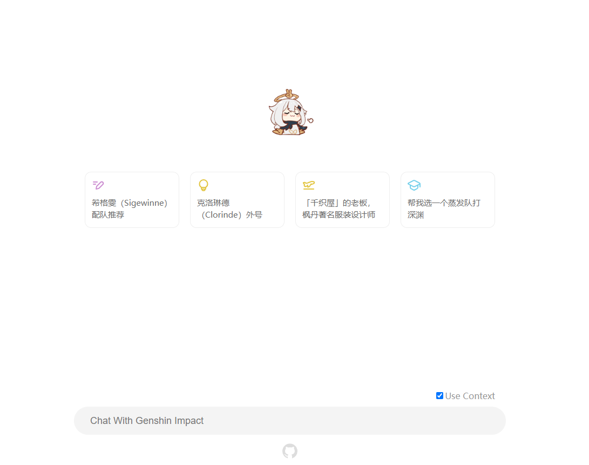

# Genshin Impact RAG

Retrieval Augmented Generation (RAG) AI with Genshin Impact's characters data.



## Run it locally

### Install Dependencies

```bash
yarn
```

### Start Cloudflare Worker API Server

For using [CloudFlare AI](https://ai.cloudflare.com/) functions.

```bash
# login once
yarn cf-login
```

```bash
# start server
yarn cf-worker
```

### Scrape Genshin Impact Character's Data

From [Bilibili Games Wiki](https://wiki.biligame.com/ys/%E9%A6%96%E9%A1%B5).

```bash
yarn scrape
```

### Embedding

Embed character's data into [chroma](https://trychroma.com/) vector DB.

```bash
# start chroma db servive with docker
docker pull chromadb/chroma
docker run -p 8000:8000 chromadb/chroma
```

```bash
# run embedding script
yarn embedding
```

### Run Backend API Service

```bash
yarn start:be
```

### Run Frontend Page

```bash
yarn start:fe
```
